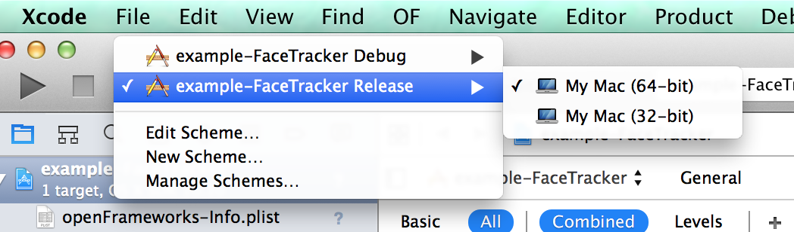

ofxDLib
=======

Addon for openFrameworks to deal with [DLib](http://dlib.net/) data types.
Inspired on ofxCv

Comes with a face tracker example and works with projectGenerator.

only tested on osx 10.9.5 with OF 0.9.3 

##To run example

Remember to download the face model .dat file [http://dlib.net/files/shape_predictor_68_face_landmarks.dat.bz2](http://dlib.net/files/shape_predictor_68_face_landmarks.dat.bz2)
Once downloaded put into the project's bin/data folder or specify it's path when calling FaceTracker.setup("path to the .dat file");

###important

Make sure you select Release instead of Debug. Otherwise it will run super slow.

